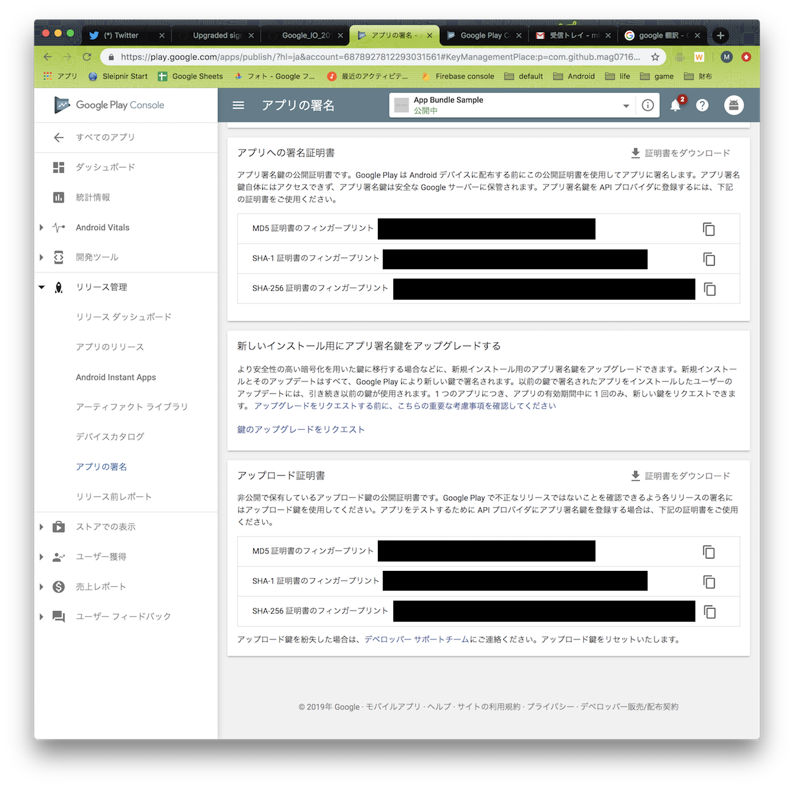
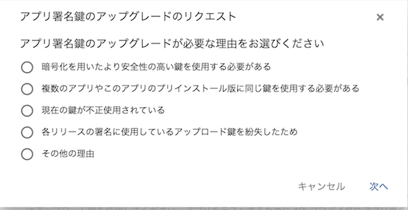
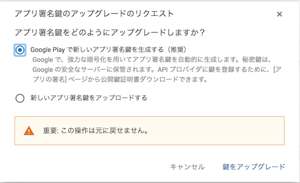
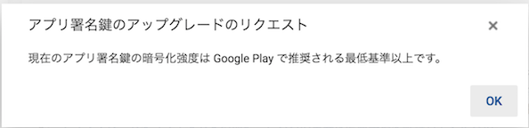
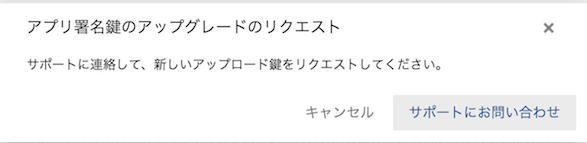
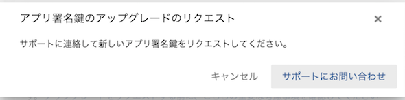

# Upgraded signing key

## 概要

暗号強度が低い署名ファイルを使っているなどの理由で1度だけ更新が可能。
新たにアップロードした署名ファイルは新規インストール時に利用され、既にインストール済みのアプリの更新には古い署名ファイルが利用されるようになる。

## 注意点

* 複数のアプリで同じ署名キーを使っていてデータの共有などを行なっている場合は、新しいキーと古いキーも認識するようにしておく必要がある
* API を利用している場合、新しいキーも登録する必要がある
* P2P でのインストールをする場合、同じ署名キー同士でないと動作しない

## 手順

1. リリース管理 -> アプリの署名を開く
1. 「新しいインストール用にアプリ署名鍵をアップグレードする」の「鍵のアップグレードをリクエスト」を選択

1. 該当する項目を選択する

1. 新しい署名ファイルを自動生成する or アップロードする

### 注意点

* 「暗号化を用いたより安全性の高い鍵を使用する必要がある」を選択し、現在の署名ファイルが安全だったら更新は不要

* 「各リリースの署名に使用しているアップロード鍵を紛失したため」「その他の理由」の場合はサポートに連絡する必要がある

## リファレンス

* https://support.google.com/googleplay/android-developer/answer/7384423#upgrade
