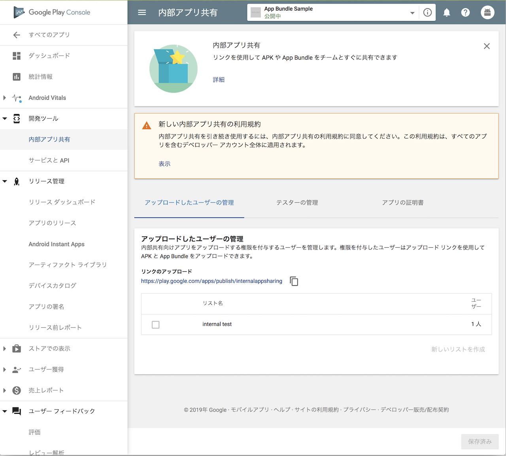
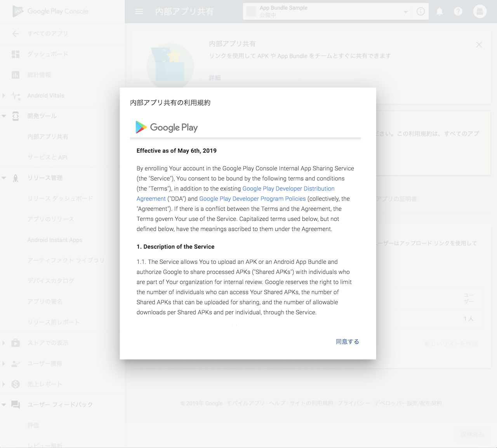
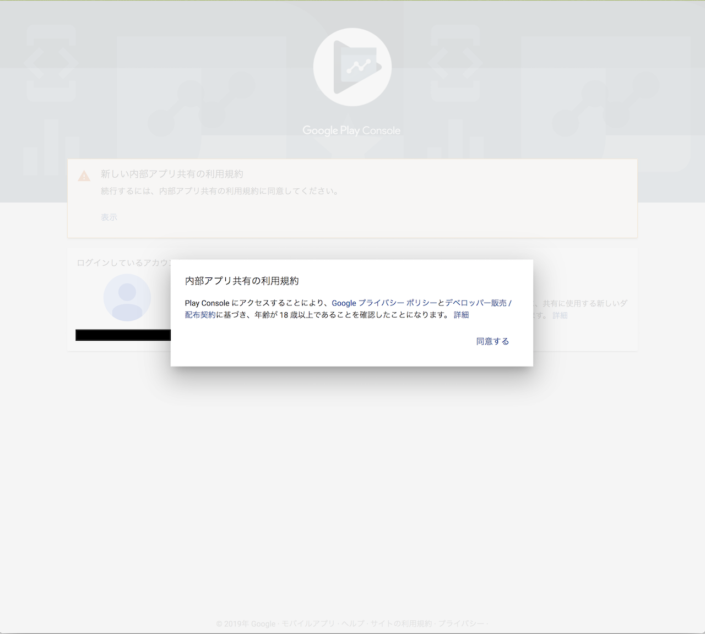
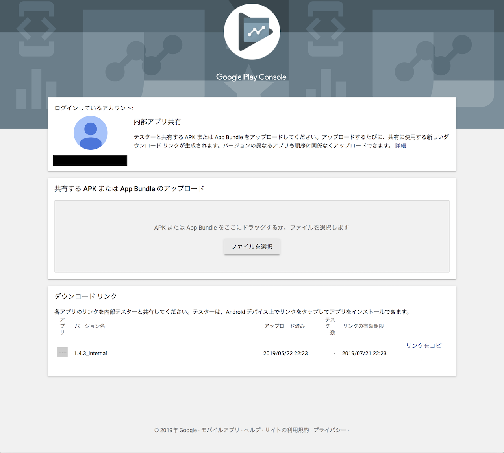

# internal app sharing

## 概要

アプリを共有するための仕組みで test track と異なり以下のメリットがある

* versionCode の更新が不要
* デバッグ用のアプリでもアップロード可能
* 証明書は何でもいい

その代わり

* アプリの更新のテストはできない

というデメリットはある。

## 有効化手順

1. Google Play Console の 開発者ツール -> 内部アプリ共有から利用規約を同意する

1. 利用規約を同意


```
Effective as of May 6th, 2019

By enrolling Your account in the Google Play Console Internal App Sharing Service (the "Service"), You consent to be bound by the following terms and conditions (the "Terms"), in addition to the existing Google Play Developer Distribution Agreement ("DDA") and Google Play Developer Program Policies (collectively, the "Agreement"). If there is a conflict between the Terms and the Agreement, the Terms govern Your use of the Service. Capitalized terms used below, but not defined below, have the meanings ascribed to them under the Agreement.

1. Description of the Service

1.1. The Service allows You to upload an APK or an Android App Bundle and authorize Google to share processed APKs ("Shared APKs") with individuals who are part of Your organization for internal review. Google reserves the right to limit the number of individuals who can access Your Shared APKs, the number of Shared APKs that can be uploaded for sharing, and the number of allowable downloads per Shared APKs and per individual, through the Service.

1.2. By enrolling in the Service, You (a) agree to only provide access to the Shared APKs to individuals in Your organization for internal review, (b) will not use the Service to publish or publicly distribute Your Shared APKs, (c) will ensure compliance with these Terms by all recipients of Your Shared APKs through the Service, and (d) acknowledge that Google is not required to review Your Shared APKs in any way, including for compliance with Google Play Policies, prior to making it available for sharing through the Service.

2. Additional Authorizations

By enrolling in the Service, You authorize Google to share Your Shared APKs with the recipients You identify through the Service.

3. Removal from the Service

3.1. Google reserves the right to terminate Your access to the Service and these Terms for any reason with thirty (30) days prior written notice.

3.2. In addition, Google reserves the right to immediately terminate Your access to the Service and these Terms if: (a) Google determines that You are in breach of these Terms; (b) You fail to provide requested information concerning Your compliance with these Terms in a timely manner; (c) You are no longer a developer in good standing under the DDA; or (e) Google is required to do so by law.

4. Changes to the Agreement

Google may make changes to these Terms at any time by sending You reasonable notice describing the modifications. Google also will post a notification on the Google Play Console describing the modifications. The changes will become effective, and will be deemed accepted by You, (a) immediately for those who opt-in to the Service after the notification is provided, or (b) for pre-existing developers, on the date specified in the notice. If You do not agree with the modifications to these Terms, You must withdraw from the Service, which will be Your sole and exclusive remedy. You agree that Your failure to withdraw constitutes Your agreement to the modified Terms.
```

## アップロード手順

1. https://play.google.com/apps/publish/internalappsharing/ を開く
1. 初回は利用規約に同意する

1. アプリバイナリをアップロードし、必要があればバージョン名を指定する


## リファレンス

* https://support.google.com/googleplay/android-developer/answer/9303479?hl=en
